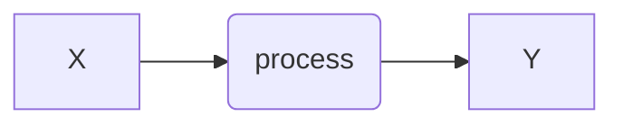
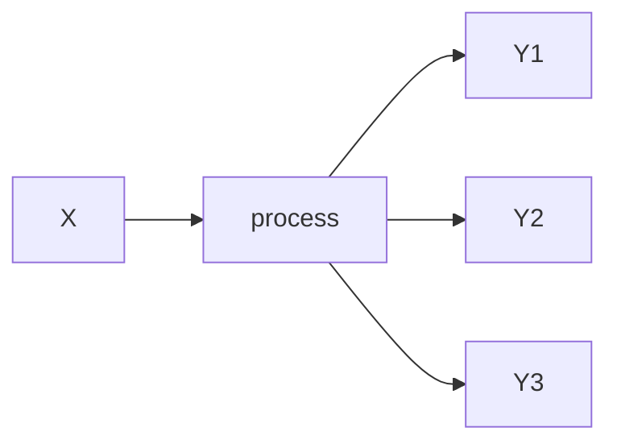

# (PART\*) Foundations of Quantative Reasoning 

# Letures {-}

## Topic 1: Introduction to FQR + Evolutionary first principles {-}

#### Goals  {-}
1. Introduce ourselves 
2. Understand the structure of the course + syllabus
3. Review of evolutionary principles
* Deterministic Processess
* Stochastic Processes
* Evolutionary Systems through the lenses of Deterministic and Stochastic Processes
* (If time permits), a tour of the VACC
---
####Evolutionary Theory... as fundamentals  {-}
... posits that living things are systems that change over space and time.

### These changes are driven by processes that can be measured and predicted (to some degree)  {-}
1.Some processes are deterministic: Have predictable outcomes that are repeatable and devoid of randomness

* Useful sometimes to think of point estimates as predictive outcomes

2.Some processes are stochastic: Have outcomes, that can be described, yet they governed by randomness

* Useful to think of distributions as “predictive” outcomes 

### Example of Deterministic processes {-}

#### examples  {-}

$$
a = F/m 
$$

> Newton's classic formula of accelation. $a$ is acceleration, $F$ is force, and $m$ is mass.

$$
y =x(1+r/m)^{Ym}
$$

> Formula for compound interest. $x$ is the current value, $y$ is future value. $r$ is the interest rate, $m$ is months, $Y$ is years.

#### Example of Stochastic processes {-}

#### examples {-}

$$
P(X = i) = ...something...
$$

>Any equation that attempts to predict "states".. for example the weather...

#### A Bernoulli process {-}
$$
P(Success) = P(X=1) = p
$$

> Where 1 is "heads"

$$
P(Failure) = P(X=0) = 1 - p
$$

>Where 0 is "tails"

#### A Binomial process (many bernoulli processess) {-}

$$
P(X = k) = \binom{n}{k}p^k(1-p)^{n-k}
$$

where $k$ is the number of successes and $n$ is the number of trials.

### How does this connect with Evolution? {-}
Evolution is the study of how and why biological systems change as a function of time. We may want to think as the possible underlyign drivers of these process as random or deterministic. 

#### What are the possible outcomes of evolutionary change? {-}

1. **Directional changes**: the allele frequency or phenotypic state changes over time since underlying processess go in the same direction.
2. **Equilibrium changes**: the allele frequency or phenotypic state stays the same over time because of opposing forces.
3. **No Evolution**: a null model? 

### Core evolutionary processess: {-}
1. **Mutation:** *Random* process that introduces variation.
2. **Drift:** *Random* process that reduces variation due to finite sampling and may give rise to spatial and temporal population structure.
3. **Selection:** *Deterministic* process that reduces variation (if directional) or maintans variation (if equilibrium).
4. **Migration:** *Deterministic* process that homogenizes variation across space.
5. **Recombination:** *Complex* process that shuffless variation across genomes.

### The challenge of the class {-}
How can we predict and characterize these process in the wild?

## Topic 3: Null models in Evolution {-}

### Goals {-}
* Review null models of evolution 

Given that evolution is the study of _change_, as a function of time or space in biological systems, **lack of change** is an intuitive **null model**, proposed by [Hardy & Weinberg](https://www.nature.com/scitable/definition/hardy-weinberg-equilibrium-122/ ).  In this context,  we often imagine an **idealized population** such that it:
  
  1. Is composed of a very large amount of individuals (effectively infinite)
2. Genetic replication is 100% perfect (there is no mutation to introduce new variation)
3. No other population is around, so there is no chance of gene-flow
4. If sexual repriduction occurs, every individual has equal chance of mating with any other individual (random mating)
5. All phenotypes (and genotypes) are effectively neutral (no selection)

### Estimating allele frequencies {-}

Lets ignore sexual reproduction for one second, and imagine that the genomes of the organisms in this population have only one gene, lets call it "gene $\alpha$", and that the gene has two _alleles_ called $A$ and $a$ (sounds familiar?).

The question then is, if we agree that the proportion of organisms with allele $A$ or $a$, say the allele frequency, is a good measurement of evolution, then if I where to measure  allele frequency, today, tomorrow, and in 100 years in this population... what should we expect?  
  
  Tacking this question requires establishing some basic notation. First we need a summary statistic... the thing we actually want to measure. For example

$$
  p_a =  \frac{n_a}{N}
$$
  
  where $N$ is the number of individuals in the population, and $n_{a}$ is the number of times allele " $a$ " is observed. In this context the alleles can either be $a$ or $A$ (since we are only envisioning a biallelic site). In other words, $p_a$ is simply the frequency of " $a$ " in the population (i.e., the sum of all $A$ and $a$). Now, **becuase in our idealized population** only $A$ and $a$ exist, hence it must be true that:
  
  $$
  p_a =1-p_A  
$$
  
  or

$$
  p_A + p_a = 1
$$
  
  This is just a logical necessity since the two frequencies all *must* add up to 1, or **the totality of the universe**... (so to speak).  Also note that, in population genetics, it is customary to call these complementary frequencies $p$ and $q$ such that

$$
  p_a  = q\ \ and\ \ p_A = p
$$
  
  and

$$
  p + q = 1
$$
  
  
  #### So what will be the frequencies of these alleles over times  {-}
  Becuase in our ideallized population _nothing_ changes, then:
  
  $$
  p_{t+1} =   p_{t}
$$
  
  Furthermore, becuase in our ideallized population _nothing_ **ever** changes, then:
  
  $$
  p_{t+n} =   p_{t}
$$
  
  ###### :crystal_ball: Thus, our null, higly idealized, model would predict no change in allele frequencies over time in the population.  {-}
  
  ### Case 2: Adding diploidy and sexual reproduction {-}
  Lets say, we pose the same question as we did above, yet we now consider that individuals are **diploids** (i.e., $2N$) and that sexual reproduction occurs (random mating). This means that each individual in the population now carries 2 copies of gene $\alpha$ and individuals may carry any allele combination of alleles. As such individuals may now be found carrying either $AA$, $aa$, $Aa$ or $aA$ combination of alleles! We often call these combination of alleles, "a genotype".

##### Now we must be able to predict, not just the allele frequency, but also the genotype frequency over time. Lets do it! {-}

* Lets simplify our math a bit by modeling the probability of observing an individual that has two identical states, either $AA$ or $aa$ (we call these homozygous states), as well as different by allelic state ($Aa$, $aA$; regarding of order) these we call heterozygous states. 

##### Probability of observing a homozygous $AA$ {-}

Assuming that the probability of sampling any $A$ is $p$ (using classical nomemclature, we could also call this $p_A$), then:
  
  $$
  Pr(Ho_{AA}) = p\ x\ p = p^2
$$
  
  it is the multiplication of two independent events. That is sampling an $A$ once ($p_A$) and then a second time.. i.e., another $p_a$
  
  #### Probability of observing a homozygous $aa$ {-}
  Assuming that the probability of sampling any $a$ is $q$ (using classical nomemclature, we could also call this $p_a$), then:
  
  $$
  Pr(Ho_{aa}) = q\ x\ q = q^2
$$
  
  #### Probability of observing a heterozygous of _any kind_ {-}
  Now here we are dealing with two dependent probability staments. That is the probability of sampling and $A$ and then and $a$ ... or ... sampling and $a$ and then and $A$.

* Probability of sampling and $A$ and then and $a$
  
  $$
  Pr(A\ and\ a) = p\ x\ q = pq
$$
  
  * Probability of sampling and $a$ and then and $A$
  
  $$
  Pr(a\ and\ A) = q\ x\ p = qp = pq
$$
  
  * Thus, the total probability is the sum of the two mutually exclusive events or:
  
  $$
  Pr(He) = f(Aa\ and\ aA ) = pq + pq = 2pq
$$
  
  ##### Recall because these are the only genotypes that exist, then it must be true that (i.e., _the "universe" must add up to 1_). This is the most commonly recognized statement of the Hardy-Weinberg principle.  {-}
  
  $$
  p^2 + 2pq + q^2 = 1
$$
  
  ##### Thus, in an idealized population, the expected frequencies of genotypes are:  {-}
  
  |Class|Expected frequency|
  |--|--|
  | $f(Ho_{AA})$ | $p^2$ |
  | $f(Ho_{aa})$ | $q^2$ |
  | $f(Het)$ | $2pq$ |
  
  ##### But what about allele frequencies? We can describe this from the genotype frequencies  {-}
  
  $$
  p = f(Ho_{AA}) + \frac{f(Het)}{2} 
$$
  
  and

$$
  q = f(Ho_{aa}) + \frac{f(Het)}{2} 
$$
  
  #### :mega: Notably, while the math has (somewhat) increased in complexity, the overall pattern remains the same  {-}
  
  |param|t|t+1|t+n|
  |--|--|--|--|
  |$p$|$p_t$|$p_t$|$p_t$|
  |$q$|$q_t$|$q_t$|$q_t$|
  |$f_{AA}$|$p_t^2$|$p_t^2$|$p_t^2$|
  |$f_{Aa}$|$2pq_t$|$2pq_t$|$2pq_t$|
  |$f_{aa}$|$q_t^2$|$q_t^2$|$q_t^2$|
  
  ##### A model of "no evolution," indeed. Lets work on some code!  {-}
  
  
## Topic 4: Natural selection {-}

### Goals {-}
* Review basic models of natural selection 

One of the core assumtions of the null model we have reviewed so far makes the assumtion that there are no fitness consequences to certain mutations or allelic states. Fitness, in this context, is the ability of an individual to survive and reproduce, compared to other individuals. A phenomenon that, over time, leads to evolutionary change in the population.

### The base model {-}
Imagine our classical one locus model. Let the one gene be called "gene $\alpha$" and that the gene has two _alleles_ called $A$ and $a$. Diploid individuals that can be born in a popualtion with this properities are" $AA$, $Aa$, or $aa$". 

In our simplest possible model, called the Hardy-Weingberg model, the population is governed by the following rules:
  
  |rule|meaning|
  |--|--|
  |No Selection|Mutations dont alter fitness|
  |No migration|There is no influx of alleles from other populations|
  |No mutation|New genetic variation cannot be created|
  |No Drift|There is no stoichastic sampling of gametes due to large pop size|
  |No assortative mating|All individuals are equally likely to contribute to the gene pool|
  
  Furthermore, the model has one intuitive axion: **all allele** and **all genotype** frequencies must add up to $1$. Thus

$p + q =1$
  
  and

$p^2 + 2pq + q^2 = 1$
  
  Under these conditions the changes in allele frequency over time is:
  
  |param|t|t+1|t+n|
  |--|--|--|--|
  |$p$|$p_t$|$p_t$|$p_t$|
  |$q$|$q_t$|$q_t$|$q_t$|
  |$f_{AA}$|$p_t^2$|$p_t^2$|$p_t^2$|
  |$f_{Aa}$|$2pq_t$|$2pq_t$|$2pq_t$|
  |$f_{aa}$|$q_t^2$|$q_t^2$|$q_t^2$|
  
  ### Darwinian fitness (A basic review) {-}
  
  What if one of the two alleles, say $a$, is not neutral? For example, makes a less efficient or less thermally stable protein. As a result individuals being born with this copy of the allele may experience a fitness ($\omega$) cost. This cost is often interpreted through the lenses of either $fecundity$ or $survival$:
  
  
  $$
  \omega = fecundity\ x\ survival
  $$
  
  or

  $$
  \omega = m\ x\ \ell
  $$
  
  
  #### What is the functional relationship between $A$ and $a$ (examples) {-}
  
  
  
  
  * $a$ is a null allele, yet $A$ fully compensates (dominant, recessive)
* $a$ is a null allele, yet $A$ **cannot** fully compensate (incomplete dominance or co-dominance)

#### The simplest possible case --> one "null" allele {-}
One that produces "nothing", or no product in relationship to the other allele. In this case, having two copies of $a$ would imply a null genotype. Yet, any genotype with at least one copy of $A$ will have suffient gene dossage regardless of the number of copies: $AA$ or $Aa$. We call this a case where $a$ is recessive. For example:
  
  |parameter|$AA$|$Aa$|$aa$|
  |--|--|--|--| 
  |Abs. Fitness ($W$)|100|100|80| 
  |Max. Fitness ($W_{max}$)|100|100|100| 
  |Rel. Fitness ($\omega$) |1|1|0.8| 
  
  #### From the relative fitness we can infeer the rate of selection:
  
  $$
  s = 1- (\omega)
  $$ 
  
  or

  $$
  s = 1- 0.8 = 0.2
  $$ 
  
  In other others individuals carrying 2 copies of $a$ have an 80% chance of not surviving and **will be removed from the population at a _rate of 20%_ from one generation to the next.**
  
  ### The basic formula for selection  {-}
  
  Since the assumptions of Hardy-Weinberg are no longer being met, the expecationa that allele frequencies will not change is no longer realistic. The question now becomes, how can we model the change in allele frequency over time?
  
  > One intuition is to simply apply a "uniform cost" to the expectation

  $$
  1 = p^2 +2pq+1^2
  $$ 
  
  becomes

  $$
  1 = p^2\omega_{AA} +2pq\omega_{Aa}+q^2\omega_{aa}
  $$ 
  
  Recall...

|parameter|$AA$|$Aa$|$aa$|
  |--|--|--|--| 
  |Rel. Fitness ($\omega$) |1|1|0.8| 
  
  For a simple numerical solution... assume $p=0.5$ and $q=0.5$
  
  $$
  1 = 0.5^2 + 2(0.5)(0.5)+0.5^2(0.8)
 $$ 
  
 $$
  1 \neq 0.25 + 0.5 + 0.2 \ (problem!)
 $$ 
  
  
  $$
  1 \neq 0.95
 $$ 
  
  #### Why does this occur? {-}
  For the "universe" to add up to 1, some individuals must be selected againt and some must be selected for. That is the individuals who fail to reproduce open up space for more offspring of individuals that dont have the $aa$ genotype. To fix this we must standarize our equation. This is done by dividing by the "mean fitness" of the population, or:
  
  $$
  1 = \frac{p^2\omega_{AA} +2pq\omega_{Aa}+q^2\omega_{aa}}{\bar{\omega}}
 $$
  
  #### Population mean fitness {-}
  This is a parameter that takes into account the sum of the expected selection coefficients of all genotypes in the population, contingent on their frequency. Sound complicated... but it is simply:
  
  $$
  \bar{\omega} = p^2\omega_{AA} +2pq\omega_{Aa}+q^2\omega_{aa}
 $$
  
  Transform $\omega$ to the selection coeffient

 $$
  \bar{\omega} = p^2(1-s_{AA}) +2pq(1-s_{Aa})+q^2(1-s_{aa})
 $$
  fold out parentheses
 $$
  \bar{\omega} = p^2-p^2s_{AA} + 2pq- 2pqs_{Aa} +q^2-q^2s_{aa}
 $$
  reorganize
 $$
  \bar{\omega} = p^2+ 2pq+q^2-p^2s_{AA} - 2pqs_{Aa} -q^2s_{aa}
 $$
  replace the Hardy-Weinberg expectation
 $$
  \bar{\omega} = 1-p^2s_{AA} - 2pqs_{Aa} -q^2s_{aa}
 $$
  
  #### For the simplest case of recessive $a$ {-}
  
  * $a$ is a null allele, yet $A$ fully compensates (dominant, recessive)
  * $a$ is a null allele, yet $A$ **cannot** fully compensate (incomplete dominance or co-dominance)

#### The simplest possible case --> one "null" allele {-}
One that produces "nothing", or no product in relationship to the other allele. In this case, having two copies of $a$ would imply a null genotype. Yet, any genotype with at least one copy of $A$ will have suffient gene dossage regardless of the number of copies: $AA$ or $Aa$. We call this a case where $a$ is recessive. For example:
  
  |parameter|$AA$|$Aa$|$aa$|
  |--|--|--|--| 
  |Abs. Fitness ($W$)|100|100|80| 
  |Max. Fitness ($W_{max}$)|100|100|100| 
  |Rel. Fitness ($\omega$) |1|1|0.8| 
  
  #### From the relative fitness we can infeer the rate of selection:
  
  $$
  s = 1- (\omega)
  $$ 
  
  or

  $$
  s = 1- 0.8 = 0.2
  $$ 
  
  In other others individuals carrying 2 copies of $a$ have an 80% chance of not surviving and **will be removed from the population at a _rate of 20%_ from one generation to the next.**
  
  ### The basic formula for selection  {-}
  
  Since the assumptions of Hardy-Weinberg are no longer being met, the expecationa that allele frequencies will not change is no longer realistic. The question now becomes, how can we model the change in allele frequency over time?
  
  
  > One intuition is to simply apply a "uniform cost" to the expectation
  
  
  

  $$
  1 = p^2 +2pq+1^2
  $$ 
  
  becomes

  $$
  1 = p^2\omega_{AA} +2pq\omega_{Aa}+q^2\omega_{aa}
  $$ 
  
  Recall...

|parameter|$AA$|$Aa$|$aa$|
  |--|--|--|--| 
  |Rel. Fitness ($\omega$) |1|1|0.8| 
  
  For a simple numerical solution... assume $p=0.5$ and $q=0.5$
  
  $$
  1 = 0.5^2 + 2(0.5)(0.5)+0.5^2(0.8)
 $$ 
  
 $$
  1 \neq 0.25 + 0.5 + 0.2 \ (problem!)
 $$ 
  
  
  $$
  1 \neq 0.95
 $$ 
  
  #### Why does this occur? {-}
  For the "universe" to add up to 1, some individuals must be selected againt and some must be selected for. That is the individuals who fail to reproduce open up space for more offspring of individuals that dont have the $aa$ genotype. To fix this we must standarize our equation. This is done by dividing by the "mean fitness" of the population, or:
  
  $$
  1 = \frac{p^2\omega_{AA} +2pq\omega_{Aa}+q^2\omega_{aa}}{\bar{\omega}}
 $$
  
### Population mean fitness {-}
  This is a parameter that takes into account the sum of the expected selection coefficients of all genotypes in the population, contingent on their frequency. Sound complicated... but it is simply:
  
  $$
  \bar{\omega} = p^2\omega_{AA} +2pq\omega_{Aa}+q^2\omega_{aa}
 $$
  
  Transform $\omega$ to the selection coeffient

 $$
  \bar{\omega} = p^2(1-s_{AA}) +2pq(1-s_{Aa})+q^2(1-s_{aa})
 $$
  fold out parentheses
 $$
  \bar{\omega} = p^2-p^2s_{AA} + 2pq- 2pqs_{Aa} +q^2-q^2s_{aa}
 $$
  reorganize
 $$
  \bar{\omega} = p^2+ 2pq+q^2-p^2s_{AA} - 2pqs_{Aa} -q^2s_{aa}
 $$
  replace the Hardy-Weinberg expectation
 $$
  \bar{\omega} = 1-p^2s_{AA} - 2pqs_{Aa} -q^2s_{aa}
 $$
  
  #### For the simplest case of recessive $a$ {-}
  
  We know that $s_{AA}  = s_{Aa} = 0$, then:
  
  $$
  \bar{\omega} = 1-p^2(0) - 2pq(0)-q^2s_{aa}
 $$
  
  Solving for the special case **(for an allele $a$ that is recessive)**:
  
  $$
  \bar{\omega} = 1-q^2s_{aa}
 $$
  
  Lets revisit the original case:
  
  $$
  1 = \frac{0.5^2 + 2(0.5)(0.5)+0.5^2(0.8)}{1-q^2s_{aa}}
 $$
  
  Plug in the denominator

 $$
  1 = \frac{0.5^2 + 2(0.5)(0.5)+0.5^2(0.8)}{1-(0.5)^2(0.2)}
 $$ 
  
  finally, the world makes sense again!
  
  $$
  1 = \frac{0.95}{0.95} = 1
 $$ 
  
  But this is a bit too esoteric... lets actually look at the genotype frequencies (for the simplest case):  
  
  |param|No evolution|selection|
  |--|--|--|
  |$f_{AA}$|$p^2$|$\frac{p^2\omega_{AA}}{1-q^2s_{aa}}$|
  |$f_{Aa}$|$2pq$|$\frac{2pq\omega_{Aa}}{1-q^2s_{aa}}$|
  |$f_{aa}$|$q^2$|$\frac{q^2\omega_{aa}}{1-q^2s_{aa}}$|
  
  #### What happens to $aa$ {-}
  
  $$f_{aa}=\frac{q^2\omega_{aa}}{1-q^2s_{aa}}$$
  
  $$f_{aa}=\frac{0.5^2(0.8)}{1-(0.5)^2(0.2)} = \frac{0.2}{0.95} = 0.21 $$
  
  recall in the HW model, the expected $q^2$ is $0.5^2 = 0.25$
  
  ### What happens to $AA$ and $Aa$ since they have the same fitness
  
  $$
  f_{AA}=\frac{p^2\omega_{aa}}{1-q^2s_{aa}}\ ;\ f_{Aa}=\frac{2pq\omega_{Aa}}{1-q^2s_{aa}}
 $$
  
  $$
  f_{AA}=\frac{0.5^2}{1-(0.5)^2(0.2)} = \frac{0.25}{0.95} = 0.263 
 $$
  
  recall in the HW model, the expected $p^2$ is $0.5^2 = 0.25$
  
  $$
  f_{Aa}=\frac{2x0.5x0.5}{1-(0.5)^2(0.2)} = \frac{0.50}{0.95} = 0.526 
 $$
  
  recall in the HW model, the expected $2pq$ is $2x0.5x0.5 = 0.50$
  
  |param|No evolution|selection ($\Delta$)|
  |--|--|--|
  |$f_{AA}$| 0.25 | 0.263 (+)|
  |$f_{Aa}$| 0.50 | 0.526 (+)|
  |$f_{aa}$| 0.25 | 0.210 (-)|
  
  #### That is selection in a nutshell! how can we derive allele after one generation of natural selection:  {-}
  
  recall that, in general

 $$
  p_{t+1} = f(Ho_{AA}) + \frac{f(Het)}{2} 
 $$
  
  under selection

 $$
  p_{t+1} = \frac{p^2\omega_{AA}}{\bar{\omega}}  + \frac{pq\omega_{Aa}}{\bar{\omega}}
 $$
  
  simplifying to

 $$
  p_{t+1} = \frac{p^2\omega_{AA} + pq\omega_{Aa} }{\bar{\omega}}
 $$
  
  and in the simpest case (selection againt recessive $a$):
  
  
  $$
  p_{t+1} = \frac{p^2\omega_{AA} + pq\omega_{Aa} }{1-q^2s_{aa}}
 $$
  
  ### A more complex scenario... What if the allele is not null?  {-}
  
  Lets entrain a different scenrario. Instead of assuming that $a$ is a "null" allele of some sort. Lets imagine that the phenotype is sensitive to the allele dosage.  In this cases $AA$ will have a phenotype, $Aa$ a different phenotype, and $aa$ yet a diferent phenotype.

#### Coefficient of dominance accounts for different phenotypes (due to allele contribution) {-}

|parameter|$AA$|$Aa$|$aa$|
  |--|--|--|--| 
  |Abs. Fitness ($W$)|100|90|80| 
  |Max. Fitness ($W_{max}$)|100|100|100| 
  |Rel. Fitness ($\omega$) |1|0.9|0.8| 
  
  #### The selection coefficient for hereozygous can be expressed as:  {-}
  
  $$
  hs = 1- (\omega)
 $$ 
  
  where $h$ is the coefficient of dominance, and $h$ will denote the "dominance" relationship between $A$ and $a$. Such that the fitness of a heterozygous is $1-hs$. In the most common cases when $h=0$ it means that $A$ is dominant over $a$.  Else, if $h=1$ it means that $a$ is dominant over $A$.  If $h=0.5$ the heterozygote is exactly intermediate. Notably, If $h < 0$ the heterozygote will have higher fitness than either homozygote (i.e., true overdominance).

|parameter|$AA$|$Aa$|$aa$|
  |--|--|--|--| 
  |General case |$1-s_{AA}$|$1-hs_{aa}$|$1-s_{aa}$| 
  
  
  ### How do we incorporate this into our math? {-}
  
  Since we often want to predict allele frequencies, we will pay attention to the $\bar{\omega}$ function. This becomes visible if we transform everything into selection coefficients:
  
  $$
  p_{t+1} = \frac{p^2\omega_{AA} + pq\omega_{Aa} }{\bar{\omega}}
 $$
  
  #### Numerator {-}
  
  $$
  p^2\omega_{AA} + pq\omega_{Aa}  = p^2(1-s_{AA}) + pq (1-hs_{aa})
 $$
  
  
  
  
  #### Denominator {-}
  
  
  
  $$
  \bar{\omega} = p^2\omega_{AA} +2pq\omega_{Aa}+q^2\omega_{aa}
$$
  
  
  
  
  Transforming $\omega$ to $s$:
  
  
  
  
  $$
  \bar{\omega} = p^2(1-s_{AA}) +2pq(1-hs_{aa})+q^2(1-s_{aa})
$$
  
  
  
  
  fold out parentheses

$$
  \bar{\omega} = p^2-p^2s_{AA} + 2pq- 2pqhs_{aa} +q^2-q^2s_{aa}
$$
  
  reorganize

$$
  \bar{\omega} = 1-p^2s_{AA} - 2pqhs_{aa} -q^2s_{aa}
$$
  
  
  
  
  #### Then it becomes:  {-}
  
  
  
  
  $$
  p_{t+1} = \frac{p^2\omega_{AA} + pq\omega_{Aa} }{\bar{\omega}} = \frac{p^2(1-s_{AA}) + pq (1-hs_{aa})}{1-p^2s_{AA} - 2pqhs_{aa} -q^2s_{aa}}
$$
  
  
  
  #### In the special case when $s_{AA} = 0$ {-}
  
  
  
  
  $$
  p_{t+1} = \frac{p^2 + pq (1-hs_{aa})}{1- 2pqhs_{aa} -q^2s_{aa}}
$$
  
  
  This is convoluted no doubt. But we will explore some code that may make this math more intuitive via simulations~!
  
  ### Finding the slope of the line (i.e., change due to selection) {-}
  
  Lets begin where we last left off (this time we are going to derive the slope as a function of fitness not selection):
  
  
  
  
  $$
  p_{t+1} = \frac{p^2 w_{AA} + pqw_{Aa}}{\bar{\omega}}
$$
  
  Since the starting condition before selection is $p$, we can derive the line for the change due to selection in one generation by calculating the difference in $p$ in one step:
  
  
  
  $$
  \Delta p = p_{t+1}  - p
$$
  
  
  
  or

$$
  \Delta p =\frac{p^2 w_{AA} + pqw_{Aa}}{\bar{\omega}}  - p
$$
  
  From this we can derive a useful expression for the change in allele frequency due to selection

$$
  \Delta p =\frac{p^2 w_{AA} + pqw_{Aa}  - p\bar{\omega}}{\bar{\omega}}
$$
  
  now fold out the mean fitness

$$
  \Delta p =\frac{p^2 w_{AA} + pqw_{Aa}  - p(p^2w_{AA} + 2pq w_{Aa} + q^2w_{aa})}{\bar{\omega}}
$$
  
  Note: please resist the urge to create a cubic polynomial! (i.e., Do not multiply $p$ by $p^2$). Instead notice that we can factor out $p$ entirely as:
  
  $$
  \Delta p =\frac{p(p w_{AA} + qw_{Aa})  - p(p^2w_{AA} + 2pqw_{Aa}+ q^2w_{aa})}{\bar{\omega}}
$$
  
  Then, the equation becomes (Nortice that we had to multiply the whole thing by -1 since the number did not go away):
  
  $$
  \Delta p =\frac{p[p w_{AA} + qw_{Aa}  - p^2w_{AA} - 2pqw_{Aa} - q^2w_{aa}]}{\bar{\omega}}
$$
  
  Now, for some tricky math... lets collect all of our $w$ terms 

$$
  \Delta p =\frac{p[p w_{AA} - p^2w_{AA} + qw_{Aa}  - 2pqw_{Aa} - q^2w_{aa}]}{\bar{\omega}}
$$
  
  Now lets factor out the $w$
  
  $$
  \Delta p =\frac{p[(p  - p^2) w_{AA} + (q  - 2pq) w_{Aa} - q^2w_{aa}]}{\bar{\omega}}
$$
  
  Some extra factorization

$$
  \Delta p =\frac{p[p(1  - p) w_{AA} + q(1  - 2p) w_{Aa} - q^2w_{aa}]}{\bar{\omega}}
$$
  
  Now recall that $p(1  - p) = pq$ ... then

$$
  \Delta p =\frac{p[pqw_{AA} + q(1  - 2p) w_{Aa} - q^2w_{aa}]}{\bar{\omega}}
$$
  
  Notice now that $q$ is a common term accross the equation ( collect it! ):
  
  $$
  \Delta p =\frac{pq[pw_{AA} + (1  - 2p) w_{Aa} - qw_{aa}]}{\bar{\omega}}
$$
  
  Now lets do some basic artihmetic.. remember our axiom = $1=p+q$:
  
  $$
  \Delta p =\frac{pq[pw_{AA} + (p + q  - p - p) w_{Aa} + qw_{aa}]}{\bar{\omega}}
$$
  
  Then:
  
  $$
  \Delta p =\frac{pq[pw_{AA} + (q  - p) w_{Aa} + qw_{aa}]}{\bar{\omega}}
$$
  
  Now lets fold out the fitness of $w_Aa$ for:
  
  $$
  \Delta p =\frac{pq[pw_{AA} + qw_{Aa}  - pw_{Aa}  + qw_{aa}]}{\bar{\omega}}
$$
  
  Rearrange and collect terms:
  
  $$
  \Delta p =\frac{pq[pw_{AA} - pw_{Aa} + qw_{Aa}   + qw_{aa}]}{\bar{\omega}}
$$
  
  Factor out $p$ and $q$:
  
  $$
  \Delta p =\frac{pq[p(w_{AA} - w_{Aa}) + q(w_{Aa}   + w_{aa})]}{\bar{\omega}}
$$
  
  #### Et Voilà, the theorem of natural selection emerges! {-}
  
  We will also explore this using some code and simulations!
  
  
  
  
  