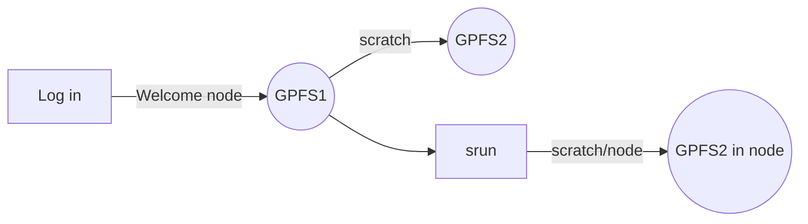

# Practicums {-}

## Topic 1: Intro to the VACC {-}


### Understanding the VACC {-}
An overly simplistic, yet intuitive introduction to our supercomputer.

1. Supercomputers do not exist in the cloud. They are physical things. We can interact with them via the internet (the cloiud?)
2. Supercompiters such as the VACC have equipmemnt that is devoted to various purposes. 
2.1. The analyses clusters
* **Bluemoon**: A 161 node, 8392 core, high-performance computing cluster, modeled after national supercomputing centers, supporting large-scale computation, low-latency networking for MPI workloads, large memory systems, and high-performance parallel filesystems.
* **DeepGreen**: DeepGreen is a new massively parallel cluster deployed in Summer 2019 with 80 GPUs capable of over 8 petaflops of mixed-precision calculations based on the NVIDIA Tesla V100 architecture.
* **BlackDiamond**: This cluster is built using AMD’s 2nd Gen AMD EPYC processor, which pushes the boundaries for x86 performance, efficiency, security features, and overall system throughput.

2.2. Storage 
* **Netfiles:** P.I.s usually pay a fee to maintain long term storage. Soem storage is included in the faculty package. Trainees and staff are dependent on the PI. Ususally many people can access these files.

2.3. File systems

* **GPFS 1**: Your home directory. Only you can access this.  
* **GPFS 2**: Your scratch directiry. Only you can access this.  

#### What can we do in, and how we can access into, the VACC {-}

##### Stand-by flow ( checking files ) {-}

``
[yourusername@vacc-user1 somewhere]$
  ``

Do not run any programs or *heavy* commands while in a welcome node. Also note that GPFS 1 has a very "low" storage memory. This is not the place to store files

##### *where am I?*  {-}
``pwd``
##### *what is in here?* {-}
``
ls``

##### Interactive work flow ( coding as you go ) {-}

``cd scratch``


Scratch is the place where we will run most analyses. It is a fast and flexible parition of the supercomputer. Yet, files only exist there for 90 days. Not designed to be used for long term storage!
  
  ```
srun -N 1 -n 5 --mem=50G -t 3:00:00 --pty bash
srun: job 12417344 queued and waiting for resources
[yourusername@node321 somewhere]$
  ```


Afert running ``srun`` we are no longer in a welcome node and thus we can start running commands without "breaking the rules" of the vacc. Notice that by inhabiting node "321," or whichever node you got, you are now interacting with an entirely diferent "machine" that has 50G of RAM. You have reserved this machine for 3 hours, after that point the system will kick you out back to the welcome node. 

#### *running your first command* {-}
``
echo "hello world"
``

congratulations you are all coders now... if you were not one before!!
  

## Topic 2: Genomes in Unix *Data challenge* my genome file and my annotation file do not match! *mon dieu!*  {-} 

A problem as old as time (not really, but humor me). As computational biologists we are often interested in investigating DNA sequences not just at the level of nucleotides but their potential funtional consequences. The challenge, however, is that, due to the inherent data complexity of DNA data, sequence data, variation data, and functional data are stored in different format that may not integrate into each other in an intuitive way. For example

1. The *standard* way of storing DNA sequences is the FASTA file
```
>NAME of sequences (e.g., "chromosome 2L" gene, chromosome scaffold); ind1
ACTGACTGACTGCGTGGCC...
>NAME of sequences (e.g., "chromosome 2L" gene, chromosome scaffold); ind2
ACTGACTGACTGCGCGGCC...
>NAME of sequences (e.g., "chromosome 2L" gene, chromosome scaffold); ind3
ACTGACTGACTGCCTGGCC...
```
2. The *standard* way of storing variation among sequences is the VCF file
```
>##fileformat=VCFv4.3
##fileDate=...
##source=...
##reference=...
##contig=<taxonomy=info>
##phasing=....
##INFO=<....>
##FILTER=<....>
##FORMAT=<....>
```
|CHROM|POS |ID|REF|ALT|QUAL|FILTER|INFO|FORMAT|ind1|ind2|ind3|
|--|-- |--|--|--|--|--|--|--|--|--|--|
X  |   12345  |  snp_111  | G  |   A   |   29  |  PASS   | NS=3;DP=14;AF=0.5;DB;H2   |  GT:GQ:DP:HQ  | 0/0:48:1:51,51 |  1/0:48:8:51,51   |1/1:43:5:.,.|
2L  |   1258  |  snp_125  | C  |   T   |   29  |  PASS   | NS=3;DP=14;AF=0.5;DB;H2   |  GT:GQ:DP:HQ  | 0/0:89:1:25,51 |  0/1:48:8:78,51   |1/0:43:5:.,.|

3. The *standard* way of storing annotations in genomes is some form of GFF file (gene/generic/general feature files; or similar)

| seqid | source | type | start | end | score | strand | phase | attributes |
| -- | -- | -- | -- | -- | -- | -- | -- | -- |
| chr2L | MAKER | gene | 5600 | 8900 | 0.95 | + | 2 | gene QXD1 |
| chr3R | BUSCO | exon | 15899 | 157800 | 0.65 | - | 0 | gene ppk785 |


 #### Case study for *Pycnopodia*{-}

**A haplotype of interest**: A study in the sea star _Pycnopodia_ has identified several genes of  interest. We would like to extract these genes from the genome of pycno for further study. 

I have already downloaded the genome from NCBI and have stored it in our shared VACC repository.
```bash
ls /gpfs1/cl/biol6990/prac2/pycno_genome.fqr.fasta
```

 #### Adquiring the genome{-}

1. Move to your scratch directory **(known skill!)**
2. create a working folder for this challenge
```bash
mkdir pycno_challenge
```
3. move into your new folder
```bash
cd pycno_challenge
```
4. Check what is inside this new folder
```bash
ls -l ./
####this is the same as just ls -l {-}
```
5. Copy the genome from the repo to your folder
```bash
cp /gpfs1/cl/biol6990/prac2/pycno_genome.fqr.fasta ./
## cp <from+file> <to>
```
6. Check what is inside this new folder... again.
```bash
ls -l ./
```

 #### Exploring the genome {-}
Explore the heads and tails command
```bash
head -n 50 pycno_genome.fqr.fasta
## head -n <nlines> <file>
```

```bash
tail -n 50 pycno_genome.fqr.fasta
## tail -n <nlines> <file>
```

 #### Adquiring the gene feature file {-}
```bash
cp /gpfs1/cl/biol6990/prac2/GeneFeatureFile.gtf ./

head -n 10 GeneFeatureFile.gtf
```
Do we observe something strange?  ... What is going on?

 #### The names appear not to match! how can we check? {-}
We can use computational tools combined with a basic understanding of the file properties to explore the files content without any need to open a gigantic genome file.

* For example, we know that, by desing, all the chromosome names in a fasta file are named using the `>` symbol. So we can use a function to _extract_ all the information attached to lines containing `>`. -- **enter `grep`**.

```bash
grep ">" pycno_genome.fqr.fasta
```

 #### Emailing the author {-}

**You**: Dear author, I am interested in conducting follow up analyses on the genome of *Pycnopodia* that you published in 2018. I am interested in extracting  some loci. Yet, when I download the genome from NCBI, the chromosomes are labebled with the standard NCBI genomic nomenclature (JASTWB0100...) and I cannot cross-validate scaffold "pycn_heli.0008". Do you have any thoughts about how to cross-validate scaffolds?


**Author**: Dear X, my appologies that you are experiencing this road block! Our analyses was conducted before the genome was made public using our own chromosome nomenclature. Here is a file with the corresponding association of the "pycn_heli" names with the JASTWB ids.

```bash
cp /gpfs1/cl/biol6990/prac2/JASTWB01_contigs.tsv ./
```

 #### Exploring the corresponding file {-}
```bash
head JASTWB01_contigs.tsv
```

 #### What to do? {-}


What is  the **best use of your time**? ... What is the **best use of *future yous* time**? For example what about if later on you want to look at many other loci.. or if you had multiple loci to extract to begin with. I submit to you that a global solution that re-labels the genome is the overall most efficient solution, despite having a larger initial investment (i.e., having to code the relabeling pipeline) it will be an overall more efficient use of research resources.
  
 ##### Lets recap what we have so far {-} 


```bash
# we made a new folder
mkdir pycno_challenge
cd pycno_challenge

# We moved the sea start genome to it
cp /gpfs1/cl/biol6990/prac2/pycno_genome.fqr.fasta ./

# we moved the GFF file to the folder
cp /gpfs1/cl/biol6990/prac2/GeneFeatureFile.gtf ./

# we obtained a master file from the "author"
cp /gpfs1/cl/biol6990/prac2/JASTWB01_contigs.tsv ./
```

 ##### Breaking down the code (lets take a reverse engineering approach!) {-}

Lets break down what is going on here .... the _stack overflow_ approach! 
>**lets talk about stack overflow** for one minute...


```bash
master_file=./JASTWB01_contigs.tsv
working_file=./pycno_genome.fqr.fasta

cp ${working_file} ./pycno_genome_modnames.fasta

ith=$(cat ${master_file} | sed '1d' | wc -l)

for i in $(seq ${ith} )
 do
  name1=$(cat ${master_file} |  sed '1d' | awk '{print $1}' | sed "${i}q;d" )
  name2=$(cat ${master_file} |  sed '1d' | awk '{print $2}' | sed "${i}q;d" )
    echo "im an changing " $name2 " to " $name1 " when i = " $i
   sed -E -i "s/${name2}.+/${name1}/g" pycno_genome_modnames.fasta
 done
``` 

 ### What are the parts of the code? {-}
 ### Variables declared by the user {-}
```bash
master_file=./JASTWB01_contigs.tsv
working_file=./pycno_genome.fqr.fasta
```
here we are declaring environmental variables. This is a convient way to pass information to our script, code, multiple times while having user provided imput just once. Imagine how cumbersone it would to have to change one small paramter 30 times across a script.. vs. declaring a global parameter once ... and changing just that!

In unix, variables are often declared with the `=` simbol and recalled with the `$` symbol. We can always spot check a variable using `echo`. lets explore some variables... **NO SPACES ALLOWED between `=` and the other stuff!**

* We can always recall the value of a variable we can use `${variable}`

```bash
a=10
echo ${a}
```

### File generated in situ (to create data redundancy!; _failsafe_) {-}
Why is the code asking us to do this? The reality is that it is not necessary but it is a failsafe custom. Basically, the way this code works, it constantly overwrites the original file. What about if we get this wrong? An easy solution is to introduce redundancy and safety copies to the process. 
```bash
cp ${working_file} ./pycno_genome_modnames.fasta
```
 #### Commands to keep in mind: {-}
1. `cp` copy `cp <file> <location>`
2. `mv` move or (_oddly_) rename `mv <file> <location>`

### Create a varible with number of itherations & introduction to loops {-}
Before we can get at what the the `ith` varaiable means, we first need to take a deep dive into _loops_.


```bash
ith=$(cat ${master_file} | sed '1d' | wc -l)
```


 #### A basic loop 1 {-}

```bash
for i in A B C
do
echo ${i}
done
```

Here the `${i}`  is the call that returns the value of `i`

 #### Creating a sequence with `seq` {-}

```bash
seq 10
#seq --help
```

 #### A basic loop 2{-}

```bash
for i in $(seq 10)
do
echo ${i}
done
```


Here we are using the power of the `$()` construction to transform the output of the `seq` function into a variable that is, at the same time, the input of the loop itself. This reveals the first path to "scaling up the code" because we can **nest** these variables into each other... `$(seq $a)`.


```bash
a=15
for i in $(seq $a)
do
echo ${i}
done
```


 ##### On local vs. global variables {-}
Notice that our loop has two variables.. it has `a`, that is globally set, and it has `i`, that iterates inside the loop... **keep track of your variables!**  

 #### What does _loops_ have to do with `ith` {-}
At this point we have covered loops. Yet, notice that we have always given the loop... either the actual objects to iterate over (`A B C`) or a number of given iterations `seq 15`. What about if we dont know how many iteration our loop may need?  That is the purpose of defining `ith`


```bash
master_file=./JASTWB01_contigs.tsv
ith=$(cat ${master_file} | sed '1d' | wc -l)
```
 ##### The layers of `ith` {-}
1. `ith` is a global variable
2. `ith` is the output of nested commands ... `$()`
3. These command a **piped workflow** of commands `cat` --> `sed` --> `wc`

 ##### a. Piped workflow {-}
Its a coding tool that uses the `|` symbol. This symbol "re-routes" the output of a function to another function, instead of reporting it to the user.


```bash
seq 15
``` 


```bash
seq 15 | head -n 3
seq 15 | tail -n 3
```

 ##### b. The `cat` command  {-}
Stands for _concatenate_ it is a versatile command with a few uses. Its most basic form is used to load the contents of a file into memory. Yet, a fancier application is to merge two, or more, files into 1. For example:
  
  
```bash
### assume that file_1.txt and file_2.txt exist {-}
cat file_1.txt file_2.txt > newfile.txt
```

1. Notice we have a new symbol here: `>` is the universal unix symbol for **save to**. In enflish this command would translate to _concatenate_ file_1.txt and file_2.txt and _save to_ newfile.txt.

 ##### Making a chimera [mini challenge] {-}
Can you create a code that takes the first 5 line of the genome and the last 5 lines of the gene feature file and merges them into an ungodly new chimeric file? can you make it a "**one liner command**"?

 ##### c. The `sed` command {-}
`sed` is a [stream editor](https://www.gnu.org/software/sed/manual/sed.html). It is a very versatile program capable of manipulating text in variety of ways, some of which we will cover in this course.... though, an entire course could be devoted to `sed`.

>What funcions will we use `sed` for in this class?

1. Removing a row of text
2. Selecting a row of text
3. Search and replace a set of characters in a line(s) of text.

 ##### c. 1 `sed` to remove rows/lines of text {-}


```bash
seq 10
seq 10 | sed "5d"
```


 ##### c. 2 `sed` to select rows/lines of text {-}


```bash
seq 10 | sed "5q;d"
```

 ##### c. 3 `sed` to find and replace {-}
One of the most powerful and widely used utilities of the program


```bash
echo "groovy UV cool cats"
echo "groovy UV cool cats" | sed "s/cats/mooses/g"
```


The general structure is `s/original/replacement/g`. In this particular sintax, the `s` a the front means to use the _substitute_ function and the `g` at the end means to apply this function _globally_. There are other options one can give `sed` but you will have to dig into the manual to learn these, which, is actually super interesting! 

* Here is one example:

```bash
head JASTWB01_contigs.tsv
head JASTWB01_contigs.tsv | sed "s/pycn_heli/SOMETHINGNEW/g"
```

 #### d. The `wc` command {-}
`wc` is a command that can be use to count the number of characters in a file or stream. in this particualr case the option `-l` tells `wc` to count the number of lines in the input file.


```bash
wc -l JASTWB01_contigs.tsv
```


 #### Lets circle back to `ith` {-}
If we put toghther the different pieces of the puzzle we can infer that: `ith` is a varible whose value is defined by the output of several piped functions. These functions first load a variable called `master_file`, which we know is the chromosome correspondance file, then it removes the first line (i.e., the header), and the it count the number of lines remaining in the correspondance file. Why would we want to do this?

  
  ```bash
ith=$(cat ${master_file} | sed '1d' | wc -l)
```
 
 #### Finally, the loop that will replace names! {-}
We are creating a loop that will go for `$ith` number of iterations.


```bash
for i in $(seq $ith)
 do
  name1=$(cat $master_file |  sed '1d' | awk '{print $1}' | sed "${i}q;d" )
  name2=$(cat $master_file |  sed '1d' | awk '{print $2}' | sed "${i}q;d" )
    echo "im an changing " $name2 " to " $name1 " when i = " $i
   sed -E -i "s/${name2}.+/${name1}/g" pycno_genome_modnames.fasta
 done
``` 


Inside the loop, two variables will be created `name1` and `name2`. These variables will have a value equal to many piped functions. We know `cat` and `sed`... what about `awk`?

#### `awk` -- a data driven scripting langage! {-}
Similar to `sed`, an entire class could be devoted to `awk`. This language is extremely versatile and can be use for very efficient data mining in unix. Here we will barely scratch the surface of its capabilities. In this course we will mostly use `awk` as a tool to extract information across entire columns in large and complex **files**... such as genomes, feature files, and other genomic datasets.


```bash
head $master_file
cat $master_file | awk -F  '\t' '{print $1}'
```


Here we are loading the file to memory, passing it to `awk` and then `awk` is printing the first column. 
* the `-F` parameter is called a **flag** and they are used to modify the behaviour of functions.
* ``awk`` _flags_ **modifier** `'{print...}'`
* `-F` means the divider of the file and `\t` means _tabs_ (this could be `,` or `;` or other dividers)
* The ``'{print $1}'`` is the core of the command and ``print $1`` means print the first column.
* **NOTICE-->** inside the `awk` command the `{ $1 }` is not a global variable, but rather a parameter inherent to `awk` ... _yes, this is exactly why coding can be conflusing!_ and needs to be practiced.
* How may we print the second column, third... fourth...

#### thus... what is this doing? {-}


```bash
  name1=$(cat ${master_file} |  sed '1d' | awk '{print $1}' | sed "${i}q;d" )
```


1. load the `${master_file}`
2. remove the header
3. print the first column
4. extact row `${i}` ... recall here `${i}` will be supplied by the loop!
5. hence... when $i = 1$ ... `${name}` will be the first name in column 1 of the file!

* lets try that


```bash
i=1

name1=$(cat ${master_file} |  sed '1d' | awk '{print $1}' | sed "${i}q;d" )
echo ${name1}
```


This action... of arbritrarily setting `i = 1` is core to debugging!... 

* **Question -> what is `${name2}`?**

### Lets run a debugging run {-}
Here we are going to use the `#` to "comment out" or "inactivate" a chunk of code, so that we can test the rest.

```bash
ith=$(cat ${master_file} | sed '1d' | wc -l)

for i in $(seq $ith)
 do
  name1=$(cat ${master_file} |  sed '1d' | awk '{print $1}' | sed "${i}q;d" )
  name2=$(cat ${master_file} |  sed '1d' | awk '{print $2}' | sed "${i}q;d" )
   echo "im an changing " $name2 " to " $name1 " when i = " $i
  # sed -E -i "s/${name2}.+/${name1}/g" pycno_genome_modnames.fasta
 done
``` 

 #### Finally, the renaming step {-}
Its made of a modified `sed` command

```bash
sed -E -i "s/${name2}.+/${name1}/g" pycno_genome_modnames.fasta
```


1. We are implementing the flag `-i` ... that tells `sed` to overwite the file given as an input.
2. Notice that here we are not using the `cat` method because we dont just want to load the data in memory, we want the _actual_ file to be changed.
3. This is also why we created a copy of genome!
4. Lastly the flag `-E` is used to activate _special_ characters called **regular expressions**
* Regular expressions are general symbols that can capture multiple types of characters


<!-- | expression | meaning | -->
<!-- | -- | -- | -->
<!-- |^ | Start of string, or start of line in multi-line pattern| -->
<!-- |\A | Start of string| -->
<!-- |$ | End of string, or end of line in multi-line pattern| -->
<!-- |\Z | End of string| -->
<!-- |\b | Word boundary| -->
<!-- |\B | Not word boundary| -->
<!-- |.|Any character except new line (\n)| -->
<!-- |(a\|b)|a or b| -->
<!-- |+| this is a modifer that means "1 or more"| -->

  
  
  
```bash
sed -E -i "s/${var1}.+/${var2}/g" file.txt
```

vs


```bash
sed -E -i "s/${var1}/${var2}/g" file.txt
```

recall...


```bash
head -n 50 pycno_genome.fasta
```
### Lets run it! Yet... {-}
Is there a plot twist? -- yes... its **slow**

```bash
master_file=./JASTWB01_contigs.tsv
working_file=./pycno_genome.fqr.fasta

cp ${working_file} ./pycno_genome_modnames.fasta

ith=$(cat ${master_file} | sed '1d' | wc -l)

for i in $(seq ${ith} )
 do
  name1=$(cat ${master_file} |  sed '1d' | awk '{print $1}' | sed "${i}q;d" )
  name2=$(cat ${master_file} |  sed '1d' | awk '{print $2}' | sed "${i}q;d" )
    echo "im an changing " $name2 " to " $name1 " when i = " $i
   sed -E -i "s/${name2}.+/${name1}/g" pycno_genome_modnames.fasta
 done
``` 

 ### The solution  {-}

Lets submit this script as a SLURM job to the VACC!! Start by copying the code below and saving it to a *new file* called `my_renaming_script.sh`


```bash
#!/usr/bin/env bash
#
#SBATCH -J rename_scr
#SBATCH -c 1
#SBATCH -N 1 # on one node
#SBATCH -t 6:00:00 
#SBATCH --mem 10G 
#SBATCH -o ./slurmOutput/rename_scr.%A_%a.out
#SBATCH -p bluemoon


master_file=./JASTWB01_contigs.tsv
working_file=./pycno_genome.fqr.fasta

cp ${working_file} ./pycno_genome_modnames.fasta

ith=$(cat ${master_file} | sed '1d' | wc -l)

for i in $(seq ${ith} )
 do
  name1=$(cat ${master_file} |  sed '1d' | awk '{print $1}' | sed "${i}q;d" )
  name2=$(cat ${master_file} |  sed '1d' | awk '{print $2}' | sed "${i}q;d" )
    echo "im an changing " $name2 " to " $name1 " when i = " $i
   sed -E -i "s/${name2}.+/${name1}/g" pycno_genome_modnames.fasta
 done
```
Make sure that _needed_ files are in the same directory as the script.. otherwise an error will occur. Then, launch the script to be run by the VACC itself using:
  
```bash
sbatch --account=biol6990 my_renaming_script.sh
```


check if the job is running by using


```
squeue -u <username>
```


Just in case, recall that you can cancell your jobs using


```
scancel <job id>
####or globally for all your jobs
scancel -u <username>
```


Lets discuss the results next class!


## Topic 3: Stat {-}

 #### Refresher of statistics (-Pract) & R refresher/introduction {-}

In this practicum, we will review some basic concepts of probability and statistics. We will do this while also covering basic functionalities of the R programming langauge.

 #### Logging into VACC to work with R{-}

We have two avenues of working in R inside the VACC. Both are acceptable in this class. For either option you must first Log into [UVM OODs](https://www.uvm.edu/vacc/kb/knowledge-base/ondemand/) system to iterface with the VACC.

1. Option 1: Use two browser tabs. one for the command line and the second to see outputs and visualizations.
2. Option 2: Use the VM of Rstudio inside the VACC.

#### Activating R in the VACC {-}

While in the VACC bash (either in OOD-direct or in the VM). 

> Use directly in the OOD shell

```bash
module load Rtidyverse
R
```
> Use in the VM shell 

```bash
module load Rtidyverse
module load rstudio
rstudio
```
 #### Loading packages needed inside R {-}
Note that `module load Rtidyverse` already comes with a lot of packages preinstalled. Lets load them
```r
library(tidyverse)
```

 #### Data challenge 1. Is "this" a good use of my time? {-}

Imagine an orchard off Mount Mansfield. In this orchard you have discovered a very rare new species of insect :beetle: that **appears** to be polyphenic at different altitudes. Studying this insect could be great for your career! One minor problem... this insect is extremely rare you only have a very small window of time to do your sampling. Is it worth even trying? 

* Local farmers report seeing 1 insect every week.
* You only have 1 hour every week to do field-work
* You need at least 30 individuals for your study. 
* What is the probability that we will get 30 insects :beetle:, or more, i.e., $Pr(X >= 30)$ during visit?
* What is the probability that we will get exactly 30 insects $Pr(X = 30)$ during your visit? (interestingly, these are two different questions). 

 ##### This is a Poission distribution issue! (yay!) {-}

$$
Pr(X=i) =  \frac{\lambda^ie^{-\lambda}}{i!}
$$

The function describes probability of an event happening a certain number of times, $i$, within a given interval of time or space (e.g., 1 hour, _etc._). Contingent on the fact that this event occurs at rate $\lambda$.

 ##### Lets find the $\lambda$ _per hour_ parameter for our insect{-}
1. Farmers see it every week
2. A week has 168 hours
3. Thus, $\lambda = 1/168 = 0.00595$  
4. Note that this means $0.00595$ how many insects you may see in an hour.


 #### The probability of observing "_exactly_ 30 insects" vs. "30 insects _or more_"... this is the crux of the difference between the `dpois` and `ppois` functions (notice that `pois` is the poisson fucntion in `R`).{-}
 

---
##### _exactly_ 30 insects :beetle:{-}

$$
Pr(X=i) = f(i, \lambda) =  \frac{\lambda^ie^{-\lambda}}{i!}
$$

This is the probability that the function falls in a determined range of probability space
##### 30 insects _or more_ :beetle:{-}

$$
Pr(X\ge i) =   1 - Pr(X=i-1) 
$$

This is the sum probabilities to the right of the value of interest. Note however that the entire probability distribution must add up to one. So substracting one to the value  of the function a $i-1$ solves the question!

##### `dpois` -> _exactly_ 30 insects :beetle:{-}
```r
dpois(30,lambda=0.00595)
```
Here `dpois` solves the equation $Pr(X=i)$ for us.

##### `ppois` -> 30 insects _or more_ :beetle: :beetle: :beetle: ... {-}
```r
1-ppois(29,lambda=0.00595)
```
Here `ppois` calculates the cummulative probability up to $i-1$ and we substract $1$ (the totality of the probability space) to obtain our desired probability. We can always think of `ppois` as the probability of 29 _or less_.


###### Why are we observing these low numbers? What is going on? {-}


 #### Let's investigate what is going on here ...{-}
```r
for(i in 0:40){
out = dpois(i,lambda=0.00595)
print(out)
}
```

Here we are introducing our first loop in `R`. Notice how it is very similar to our loops in `unix`... yet they are different. For examples the variable `i` is recalled with `i` (i.e., itself) as opposed to `${i}` like in unix. 


#### Let's make it more human friendly {-}

```r
for(i in 0:40){
out = dpois(i,lambda=0.00595)
print(paste("when i=", i, "Pr =", out, sep = " ") )
}
```

##### Let's visualize it {-}

We are going to create a data frame object in order to store the output of our loop. This will allow us to plot our results.

```
library(foreach, lib.loc = "/gpfs1/cl/biol6990/R_shared")
```

To do this we are going to use **enhanced loops** from the `foreach` package in `R`. I basically never use basic loops anymore, since these `foreach` loops are so powerful!

```r
foreach(i = 0:40, .combine = "rbind")%do%{
out = dpois(i,lambda=0.00595)
data.frame(iparam = i, Prob = out)
}
```

 ##### save it to an object{-}
 
 ```r
 mydf = foreach(i = 0:40, .combine = "rbind")%do%{
 out = dpois(i,lambda=0.00595)
 data.frame(iparam = i, Prob = out)
 }
 ```

Where `mydf` is an object with colums `mydf$iparam`, `mydf$Prob`,


##### Now lets use ggplot to visualize the curve.{-}

here we are going to use the `%>%` symbol to pipe data in R. This is similar to `|` in unix. We are going to pipe the data to the `ggplot` function, a powerful visualization tool! 

  ```r
 mydf %>% 
 ggplot(aes(x=iparam ,y=Prob)) + geom_line() -> myplot
 ggsave(myplot, file = "myplot.pdf", w = 4, h = 4)
 ```
 
 ##### lets modify $\lambda$ to 10{-}
 
 ```r
 foreach(i = 0:40, .combine = "rbind")%do%{
 out = dpois(i,lambda=10)
 data.frame(iparam = i, Prob = out)} %>%
 ggplot(aes(x=iparam ,y=Prob)) + geom_line() -> myplot
 ggsave(myplot, file = "myplot.pdf", w = 4, h = 4)
 ```
 
 ##### Lets plot a sample of  many $\lambda$ parameters {-}
 
 To this end we are going to use a nested foreach loop
 
 ```r
 mydf_double = 
 foreach(l = 0:10, .combine = "rbind")%do%{
 foreach(i = 0:40, .combine = "rbind")%do%{
 out = dpois(i,lambda=l)
 data.frame(lambda = l, iparam = i, Prob = out)
 } # i loop
 } # l loop
 ```
 
 Lets map $\lambda$  to color
 
 ```r
 mydf_double %>% 
 ggplot(aes(
 x=iparam,
 y=Prob,
 color = as.character(lambda) 
 )) + 
 geom_line() -> myplot
 ggsave(myplot, file = "myplot.pdf", w = 4, h = 4)
 # These spacing patterns are tolerated by R ...
 
 # (not other languages like python).
 ```
 
 
 ##### Why I am plotting $\lambda$ `as.character`? What would happen if I allow it to be a number? {-}
 
 ##### Also, should you conduct your study in a universe where $\lambda=0.05$ vs $\lambda=10$...?{-}


##### Generalizing some things{-}

Note that these function structure `dpois` or `ppois` also exist for all sorts of fucntions ... such as `binom` (binomial), `norm` (normal) ... This will come in handy in later parts of the class.


#### Data challenge 2. Is this apples to oranges, apples to apples, or underpowered? (but it is :ocean: _sea snails_ :shell:!).{-}

A certain species of marine snail :shell: lives in an intertidal ecosystem. A 30 year study  has shown that the diameter of shell phenotypes vary across the intertidal, and that the phenotypic variation follows a "_normal_" (or _Gaussian_) distrbution with different parameters across the low and high intertidal microhabitats.

> The formula for _Gaussian_ distribution is
> 


$$
f(i | \mu,\sigma^2) = (\sigma\sqrt {2\pi})^{-1} e^{-\frac{1}{2} (\frac{i-\mu}{\sigma})^2 }
$$

With core parameters being $\mu$ (mean) and $\sigma$ (standard deviation). And special case 
> The _Normal_ is a special _Gaussian_ case
>


$$
f(i | 0,1) =  \frac{e^{\frac{-i^2}{2}}}{\sqrt{2\pi}}
$$

The 30 year study indicate that, in the upper tide, :shell: diameters can be described as random variables $I$ that behave as described below

| tidal habitat | :ocean::shell:  function |

| -- | -- |
|Upper Tide|$I_u \sim \mathscr N(10.2,3.8)$|
|Lower Tide|$I_l \sim \mathscr N(11.5,5.3)$|

* Note that $I_u \sim \mathscr N(10.2,3.8)$ ... **is just mathematical notation for "follow a _Gaussian_/_Normal_ dristibution with mean 1.2 and standard deviation 0.8"** (in the upper tidal zone, anyways). 

The challenge is simple, based on these known statistical properties of the populations, **how many individuals** should I sample across both microhabitats in order to show that the diameters of :shell: across these habitats is different... at a significance level of 5% (i.e. two-tailed $\alpha = 0.05$)?


 ##### This challenge is ultimately all about (statistical) _power_!{-}
                                                                                                                                     One of the most foundational questions of quantitative analysis is whether or not two observations sampled from nature derive from the results of **the same** or **different** biological (or physical, chemical,...) processess. The common null expectation  is that observations  from a population derive from the same process. This is that, many from a **random samples** $i$ :shell:  ($I = i_1, i_2, i_3 ...$) that will be distributed as  $I \sim \mathscr N(\mu,\sigma^2)$. 
                                                                                                                                     
* This gives rise to the language of "Null hypothesis"
* More precisely, the null hypothesis ($H_0$) is that any two sets of observations are simply derived from the same underlying distribution (i.e., are generated by the same process).
* Producing evidence to the contrary (i.e., that two observations do not derive from the same distribution; $H_1$) suggest that the underlying biological process at play may be different. And that may be very interesting... (example: drug treatments, histories of selection, _etc._)

#### Our capacity to effectively be able to reject this null hypothesis, if the samples truly come from different distributions, is what we call statistical power. There are several types of power {-}


||$H_0\ true$|$H_0\ false$|
|--|--|--|
|$H_0\ rejected$|$\alpha$|$1-\beta$|
|$H_0\ not\ rejected$|$1-\alpha$|$\beta$|

or

||$H_0\ true$|$H_0\ false$|
|--|--|--|
|$H_0\ rejected$|False Positive|$power$|
|$H_0\ not\ rejected$|True Negative|False Negative|


* More formally power is the probability that we will correctly reject the null hypothesis (assuming that the alternative hypothesis is in fact true):

$$
power = 1- \beta = Pr(reject\ H_0 | H_1\ is\ true)
$$

* Intuitively this may be interpreted as... if we have power = 95%.. then... if I repeat my experiment 100 times, 95 times I should correctly reject the null (i.e., get a "true positive"). Yet, logically this suggests that 5 times I will get a **"false negative"**... but I can live with that.
* _P_-value **thresholds** (e.g., 5% significance) are called $\alpha$ and corresponds to the "tolerance" for **"false positives"** that we as investigators are willing to accept.


#### Ok... lets get to simulating Virtual  :robot: :ocean: Snails :shell:{-}

Whereas the functions `pnorm` and `dnorm`  (recall `ppois` and `dpois`) are desgined to describe probabilties, we can do the reverse by using `rnorm`. In this context, what the function seeks to do is to **sample** or simulates samples from a distribution of known parameters.

```r
##### Simulate an individual (upper tide)
rnorm(n=1, mean = 10.2, sd = 3.8)
#####function (n, mean = 0, sd = 1)
```
```r
##### Simulate a population (upper tide) 
rnorm(n=15, mean = 10.2, sd = 3.8)
#####function (n, mean = 0, sd = 1) 
```

#### Population mean ($\mu$) vs. sample mean ($\bar{x}$) {-}

While we know that the upper tidal snails have :ocean::shell: $\sim \mathscr N(10.2,3.8)$, and thus the. **true** mean of the population should be $12.2$ what would happen if we calculate the mean of our sample `rnorm(n=15, mean = 10.2, sd = 3.8)`.

```r
foreach(i = 1:10, .combine = "rbind")%do%{
rnorm(n=15, mean = 10.2, sd = 3.8) %>% mean -> xbar
data.frame(trial=i, mean=xbar) 
}
```


##### Why is there noise around the mean ... when these are simulated Virtual  :robot: Snails :shell:? (hint -- sample means are strongly affected by the sample size and the variance $\sigma$ of the population ) {-}


#### The impact of sample size on $\bar{x}$ {-}

```r
mean_explorer=
foreach(i = 1:500, 
.combine = "rbind")%do%{
rnorm(n=i, mean = 10.2, sd = 3.8) %>% mean -> xbar
\data.frame(samplesize=i, mean=xbar)
}
mean_explorer %>%
ggplot(aes(
x=samplesize,
y=mean
)) +
geom_line() +
geom_hline(yintercept = 10.2) -> myplot
ggsave(myplot, file = "myplot.pdf", w = 6, h = 4)
```

#### :mortar_board:HOMEWORK:mortar_board: : please include in your next reflection: {-}

1. an exploration of the variance `sd` parameter. Plot it using the `color` option in ggplot. Explore at least 4 other `sd` parameters.
2. Also include small reflection on "what evolutionary force may reduce variance in a phenotype?"


#### Lets now compare the upper and lower intertidal populations{-}

```r
#simulate high tide
upper_samps =
data.frame(
shell=rnorm(n=25, mean = 10.2, sd = 3.8),
habitat="upper"
)

#simulate low tide
lower_samps =
data.frame(
shell=rnorm(n=25, mean = 11.5, sd = 5.3),
habitat="lower"
)
both_samps = rbind(upper_samps, lower_samps)
```


### Visualization with box plots {-}

```r
both_samps %>%
ggplot(aes(
x=habitat,
y=shell,
)) +
geom_boxplot()-> myplot
ggsave(myplot, file = "myplot.pdf", w = 6, h = 4)
```

##### Simulation based power analysis {-}

With all the pieces in place in place, we can finally dive into the power analysis proper. There are many ways to do a power analysis, some are off-the-shelf methods that use paramteric assumotions. Those are fine. Though, lets explore using simulations (as we have been doing it) to assess power across our tests. 

```r
power_analysis=
foreach(N = seq(from=10, to=1000, by=10), .combine = "rbind")%do%{
foreach(k=1:100, .combine = "rbind")%do%{

#simulate high tide

upper_shells_sample=rnorm(n=N, mean = 10.2, sd = 3.8)
#simulate low tide
lower_shells_sample=rnorm(n=N, mean = 11.5, sd = 5.3)
# run the test

test_result=t.test(upper_shells_sample,lower_shells_sample)
#has the null hypothesis been rejected? it should be!

true_positive=test_result$p.value < 0.05
#create an output data frame
output =
data.frame(
sample_size=N,
simulation_id=k,
true_positive=true_positive
)

#####explicitly tell the loop to return the "output" into memory{-}
message(paste("just finished", k, "of", N, sep = " "))
return(output)
} # close k
} # close N
```

 ##### Now let's summarize the output{-}
 
 ```r
 power_analysis %>%
 group_by(sample_size, true_positive) %>%
summarize(observations=n()) -> true_false_table
```

###### Graph{-}

```r
true_false_table %>%
ggplot(aes(
x=sample_size,
y=observations/100,
color=true_positive
) + geom_line() +
ggtitle("Simulated power of alpha 5% at sample size:")-> myplot
ggsave(myplot, file = "myplot.pdf", w = 6, h = 4)
```

###### So the sample size is...? {-}

```r
true_false_table %>%
filter(true_positive == TRUE) %>%
filter(observations > 95) %>%
arrange() %>%
head(1)
```

huzza for simulated Virtual  :robot: :ocean: Snails :shell:!


## Topic 4: Scaling up nalytical pipelines using the VACC + Null model testing! {-}

A common practice in evolutionary biology is to test whether real, or simulated data (under a set of conditions), fit the mathematical expectations of the   [Hardy & Weinberg](https://www.nature.com/scitable/definition/hardy-weinberg-equilibrium-122/) model. As part of this exercise we will also practice two important tools for scaling up research. These are **functions** and **arrays**.

 ### Data challenge 1: Building functions to explore Hardy & Weinberg, and sampling {-}
Lets start by creating a fundtion in R to explore whether user provided values of $f_{AA}$ , $f_{aa}$, $f_{Aa}$ of a simulated population, fit with the expectations of Hardy & Weinberg. 

```r
HW.fit = function( AA, Aa, aa ){
  
  # First sanity check
  # Helping the user by providing error messages in case of bad input
  for(i in c(AA, Aa, aa)){
    if(is.numeric(i)){}else(stop("Genotypes are not numeric!"))
  }
  
  # First estimate sample size
  N=AA+Aa+aa
  # Second calculate allele frequencues
  p=(2*AA+Aa)/(2*N)
  q=(1-p)
  
  ## If the data made it this far the it means that it must be look like population genetic data..
  # Now lets calculate the expected frequencies of genotypes we should see:
  Exp_AA = p^2
  Exp_Aa = 2*p*q
  Exp_aa = q^2
  
  ## Now lets calculate a statistic of goodness of fit.
  ## First create two "vectors (these are R objects)," one for the observed counts and the second for the expected counts. 
  expected_freq = c(Exp_AA, Exp_Aa, Exp_aa)
  observed = c(AA, Aa, aa)
  
  #conduct the test
  test = chisq.test(observed, p = expected_freq)
  
  #output
  output = data.frame( p.value = test$p.value)
  return(output)
  
}## end function HW.fit

```
### Lets break down this code bit-by-bit {-}

#### The function's architecture {-}
```r
HW.fit = function( AA, Aa, aa ){
}
```
Where  `AA`, `Aa`, and `aa` are the inputs to the function. They are expected to be provided by the user. Alternatively you can **set**  default parameters

```r
HW.fit = function( AA=720, Aa=160, aa=120 ){
}
```
The assumtion is that these arguments will be passed down into the function.

#### Communicating with the user .. you or otherwise {-}
```r
for(i in c(AA, Aa, aa)){
  if(is.numeric(i)){}else(stop("Genotypes are not numeric!"))
}
```
This code checks for the data properties and outputs an error if conditions are not met

#### Create internal variables from user inputs{-}
```r
# First estimate sample size
N=AA+Aa+aa
# Second calculate allele frequencues
p=(2*AA+Aa)/(2*N)
q=(1-p)
```
Parses the input data into other types of data to be used in down stream analyses. Here are are creating variables for `N` sample size, as well as `p` and `q`. 

#### Create test statistic {-}
Here we have to do a quick review of math one more time.  Basically what we seek to do here is to ask a simple question. Are the observed values for `AA`, `Aa`, `aa` what we would expect based on the Hardy & Weinberg expectation? Recall:
  
  $$
  Pr(Ho_{AA}) = p^2
$$
  
  $$
  Pr(Ho_{aa}) = q^2
$$
  
  $$
  Pr(He) = 2pq
$$ 
  
  We can calculate these expectations as follows: 
  ```r
Exp_AA = p^2
Exp_Aa = 2*p*q
Exp_aa = q^2
```

#### Fitting a $\chi^2$ test for observed vs. expected. {-}
We can use the built in $\chi^2$  test in `R` to test whether the expected frequencies and the observe frequencies match. More formally the test looks for the association between two variables that the dimentions of an contingency table influence each other or are independent of each other. 

> use  $\chi^2$ for large sample sizes, and Fishers Exact test for smaller sample sizes (single digits).


```
expected_freq = c(Exp_AA, Exp_Aa, Exp_aa)
observed = c(AA, Aa, aa)

#conduct the test
test = chisq.test(observed, p = expected_freq)
```
To be prescise here, our null hypothesis is that the observed values are derived from, or consistent with, the expectations of Hardy & Weinberg. Simply put a $P-value < 0.05$ indicates a deviation from Hardy & Weinberg.

### Report the output {-}
Finally we are creating an output, a data frame, that will save the $P-value$ and some information provided by the user, a `testid`. Notice, that we are telling the function to `return` the `output` object... this is key for functions, otherwise nothing will be saved to memory.
```r
#output
output = data.frame(p.value = test$p.value)
return(output)
```
### Some values to try it out {-}

|case|AA|Aa|aa|
|--|--|--|--|
|ex.1|720|160|120|
|ex.2|10|180|810|

```r
HW.fit(720,160,120)
HW.fit(10,180,810)
```

### Data challenge 2: Producing large simulations using arrays {-}

Lets say that you wanted to conduct a simulation experiment trying to determine the number of Hardy & Weinberg **false positives** that you observe as a function of _sample size_,  _allele frequency_, as well as a function of statistical stringency, i.e,. $\alpha$ across 1000 simulated loci. 

This is sort of tricky because we have to simulate 1000 mutations (each with 3 genotypes), across various levels of base $p$,  with several sample sizes $N$, and evaluate them at various levels of $\alpha$ ... like so

|param.set|$p$|$N$|$\alpha$|
|--|--|--|--|
|1|0.1|10|0.1|
|2|0.4|10|0.1|
|3|0.6|10|0.1|
|4|0.8|10|0.1|
|5|0.9|10|0.1|
|6|0.1|100|0.1|
|7|0.4|100|0.1|
|8|0.6|100|0.1|
|9|0.8|100|0.1|
|10|0.9|100|0.1|
|11|0.1|500|0.1|
|12|0.4|500|0.1|
|13|0.6|500|0.1|
|14|0.8|500|0.1|
|15|0.9|500|0.1|
|16|0.1|1000|0.1|
|17|0.4|1000|0.1|
|18|0.6|1000|0.1|
|19|0.8|1000|0.1|
|20|0.9|1000|0.1|
|21|0.1|10|0.05|
|22|0.4|10|0.05|
|23|0.6|10|0.05|
|24|0.8|10|0.05|
|25|0.9|10|0.05|
|26|0.1|100|0.05|
|27|0.4|100|0.05|
|28|0.6|100|0.05|
|29|0.8|100|0.05|
|30|0.9|100|0.05|
|31|0.1|500|0.05|
|32|0.4|500|0.05|
|33|0.6|500|0.05|
|34|0.8|500|0.05|
|35|0.9|500|0.05|
|36|0.1|1000|0.05|
|37|0.4|1000|0.05|
|38|0.6|1000|0.05|
|39|0.8|1000|0.05|
|40|0.9|1000|0.05|
|41|0.1|10|0.01|
|42|0.4|10|0.01|
|43|0.6|10|0.01|
|44|0.8|10|0.01|
|45|0.9|10|0.01|
|46|0.1|100|0.01|
|47|0.4|100|0.01|
|48|0.6|100|0.01|
|49|0.8|100|0.01|
|50|0.9|100|0.01|
|51|0.1|500|0.01|
|52|0.4|500|0.01|
|53|0.6|500|0.01|
|54|0.8|500|0.01|
|55|0.9|500|0.01|
|56|0.1|1000|0.01|
|57|0.4|1000|0.01|
|58|0.6|1000|0.01|
|59|0.8|1000|0.01|
|60|0.9|1000|0.01|

### So what should we do? {-}


* Run a multilayered nested loop?
* Use HPC arrays to paralelize this analysis? (<-- Lets try this)

Array jobs are a tool available in HPC clusters that allow launching the same job across multiple independent cores. Most notably, each iteration of the array can take in a set of different values hence allowing us to parallelize analyses easily.  

### First lets import a copy of our script{-}

```bash
#go to scratch
mkdir pract_4
cd pract_4
module load Rtidyverse 
cp /gpfs1/cl/biol6990/prac4/hw.test.R ./
```

#### Lets create a script to paralelize our simulation{-}
Try it out... make sure to exit and re-eneter R... use `q("n")` to exit.

#### Part 1. R portion{-}

```r
## ---------------------------
## Script name: simulate.HW.R
## Purpose of script: FQR practicum 4
## Author: Dr. JCB Nunez
## Date Created: 2024-01-07
## Copyright (c) Joaquin C. B. Nunez, 2024 [if aplicable]
## Email: joaquin.nunez@uvm.edu
## ---------------------------
## Notes: For classroom use!
## ---------------------------

# User define inputs
args = commandArgs(trailingOnly=TRUE)
N=as.numeric(args[1])
init_p=as.numeric(args[2])
alpha=as.numeric(args[3])

### Load libraries
library(foreach, lib.loc = "/gpfs1/cl/biol6990/R_shared")
#this will allow us to import our function (that we previously made) into R.
source("hw.test.R")
#HW.fit(720,160,120, "ex.1")

### USER PROVIDED INPUT

###

## Some dummy examples
#N=1000; init_p=0.6; alpha=0.01
simulation.output =
foreach(i=1:1000, .combine="rbind")%do%{

############ ########## ########### ####### ###########
### WE WILL COVER THIS IN LATER LECTURES! DO NOT WORRY!!!
AA_sim=rbinom(1, N, p=init_p^2)
aa_sim=rbinom(1, N, p=(1-init_p)^2)
Aa_sim=rbinom(1, N, p=2*((1-init_p)*init_p))
############ ########## ########### ####### ###########

message( paste("sampled AA is", AA_sim,
"| sampled aa is", aa_sim,
"| sampled Aa is", Aa_sim, sep =" "))

HW.fit(AA_sim,Aa_sim,aa_sim)
}

logical.vec = table(simulation.output < alpha)

final.output =
data.frame(
sample_size=N,
simulations=1000,
initial_freq=init_p,
significance_tresh=alpha,
test=logical.vec
)

save(
final.output , 
file = paste("chunk_pra4",N,init_p,alpha, "Rdata", sep =".") 
)
```
Save to your folder using OODs capabilties as `myfile.R`


#### Lets look at our a parameter file {-}
Lets copy and explore our premade file:
  ```bash
cp /gpfs1/cl/biol6990/prac4/parameter.file.txt ./
  head parameter.file.txt
```

#### Part 1. VACC (Unix) portion {-}

```bash
#!/usr/bin/env bash
#
#SBATCH -J run_array
#SBATCH -c 1
#SBATCH -N 1 # on one node
#SBATCH -t 6:00:00 
#SBATCH --mem 10G 
#SBATCH -o ./slurmOutput/run_array.%A_%a.out
#SBATCH -p bluemoon
#SBATCH --array=1-60

module load Rtidyverse

paramfile=parameter.file.txt

#### Recall in R {-}
#####N=as.numeric(args[1]) {-}
#####init_p=as.numeric(args[2]){-}
#####alpha=as.numeric(args[3]){-}
#####jobnum  p       n       a{-}

init_p=$(cat ${paramfile} |  sed '1d' | awk '{print $2}' | sed "${SLURM_ARRAY_TASK_ID}q;d" )
N=$(cat ${paramfile} |  sed '1d' | awk '{print $3}' | sed "${SLURM_ARRAY_TASK_ID}q;d" )
alpha=$(cat ${paramfile} |  sed '1d' | awk '{print $4}' | sed "${SLURM_ARRAY_TASK_ID}q;d" )

Rscript --vanilla myfile.R ${N} ${init_p} ${alpha}

```

Save to your folder using OODs capabilties as `launch.myfile.sh`

 ##### Launch with: {-}

```bash
sbatch --account=biol6990 launch.myfile.sh
```
Lets check on the status of the job.. they should run pretty quickly.... also Lets look at job statisitcs
```
my_job_statistics <id>
```

#### Data challenge 3: Processing multiple array outputs into a final analysis {-}

We are going to collate all of this data using an integrated pipeline of R and Unix... through R using the `system` command!
```bash
module load Rtidyverse 
```
#### Collate and analyse the output by combining Unix and R

```r
#load important libraries
library(foreach, lib.loc = "/gpfs1/cl/biol6990/R_shared")
library(tidyverse)

#use a loading loop with system to read all the files
command = paste("ls | grep 'chunk_pra4' " )
files_o = system(command, intern = TRUE )

collated.files =
foreach(i=files_o, .combine="rbind")%do%{
message(i)
o = get(load(i))
}

## Lets graph our results
collated.files %>%
ggplot(aes(
x=sample_size,
y=test.Freq,
color=as.character(significance_tresh)
)) + 
geom_line() +
geom_point() +
facet_grid(test.Var1~initial_freq, scales = "free_y") ->
hw.falsenegs

ggsave(hw.falsenegs, file = "myplot.pdf", w = 9, h = 4)
```


What can we infer from this simulation analysis?


## Topic 5: Creating functions to simulate selection {-}


```bash
cd ~/scratch
mkdir practicum_5
cd practicum_5
```

The goal of this practicum are:
  * To create a function that can simulate determistic patterns of selection 
* To generare a script with said function that can take user inputs
* To deploy the script using arrays to simulate various scenarious
* To analyze the outputs

### Part 1: creating a fucntion for natural selection {-}

The first challenge is to assess what are the variables that we may request from the user in order to generate a final product. This is an important consderation for us as "coders" that we must think about before jumping to coding. -- _Coding begins at the white board._

### What variables may we want to consider? {-}

* allele frequencies?
  * fitnesses? 
  * Dominance coefficients?
  * Population sizes?
  * etc... etc..

### challenge.. allow the user to input the raw genotype counts.{-}

Imagine a populaiton of insects of the same species. This species has a polyphenism: Red insects are toxic. Purple insects and Blue insects dont have toxins. The USDA has approved the use of a hyper specialzied pesticide that only targets some aspect of the toxin pathway. Insects witouth the toxins will process the chemical with no effects. The USDA has hired you as a genetics consultant to ascertain the impact of natural selection driven by this pesticide in the insect. Yet, they also want you to create a computer function that a farmer can use to do long term monitoring.

#### Here is what we know about this bug:{-}

The toxin gene is mendelian and the protein produced naturally changes the color of the bugs carapace. Hence the color is a "true" (v.s. linked) indicator of the toxin genotype/phenotype.

####### |Blue|Purple|Red|
#######    |--|--|--|
#######    |AA|Aa|aa|
  
  After a generation of selection, the farmer puts out a trap in two sites,  observes the average fecundity of each female in the trap, per genotype, after applying pesticide in a given site, and collects insect counts.

* Control site

 ###### <!-- |Blue|Purple|Red| -->
 ######  <!-- |--|--|--| -->
 ######   <!-- |2500|2500|2500| -->
  
  * Pesticide site

  ###### <!-- |Blue|Purple|Red| -->
  ######  <!-- |--|--|--| -->
  ######  <!-- |2500|2500|2100| -->

  For the purposes of simplicity lets just assume that these counts are a proxy for fitness. And that the blue bugs have lower fecundity is the "selection effect"... i.e., red bugs are investing ATP in detoxifying and not investing it in eggs... just entretain this thought experiment for a second...

### How can we quantify selection with this data? {-}

Clearly there appears to be something going on in these data. Pesticides are usually a very strong source of selection. Lets build some funky simulations so aspects of the data:
  
  
  #### the agency wants to know: how "fast" (how many generations) will the "toxic" allele be eliminated under this selection regime that reduces fecundity? {-}
  
  ```r
#step 1 find the relative fitnesses of each genotype
AA=2500; Aa=2500; aa=2100
max_w = max(AA, Aa, aa)

#step 2: calculate relative fitness {-}
wAA = AA/max_w
wAa = Aa/max_w
waa = aa/max_w

message( paste("AA w is", round(wAA, 3), "Aa w is", round(wAa, 3), "aa w is", round(waa, 3), sep = " "  ) )

#step 3 assume, for simplicity that the true allele frequencies in the population before selection are p = 0.5 and that q = 0.5
p=0.5
q=0.5

#step 4
calc_p_t1 = function( p, q, wAA, wAa, waa  ){
  num=p^2*wAA + p*q*wAa
  dem=p^2*wAA + 2*p*q*wAa + q^2*waa
  p_t1 = num/dem
  return(p_t1)
} 

calc_p_t1(p, q, wAA, wAa, waa)
```

$$
  p_{t+1} = \frac{p^2\omega_{AA} + pq\omega_{Aa} }{\bar{\omega}} 
$$
  
  ### Yet, this is just a prediction after one generation. How can we get we simulate multiple generations? {-}
  
  ```r
calc_p_t1 = function( p, q, wAA, wAa, waa ){
  num=p^2*wAA + p*q*wAa
  dem=p^2*wAA + 2*p*q*wAa + q^2*waa
  p_t1 = num/dem
  return(p_t1)
} 

library(foreach, lib.loc = "/gpfs1/cl/biol6990/R_shared")
#lets carry over p, wAA, wAa, waa from above
message(paste(p, wAA, wAa, waa, sep = " ") )

# create an empty variable for "recursive" use
p_recur=c()
#lets simulate 1000 generations

simulating.selection=
  foreach(g=1:1000, .combine = "rbind")%do%{
    if(g==1){p_recur[g]=p}
    p_recur[g+1] = calc_p_t1(p_recur[g], 
                             (1-p_recur[g]),
                             wAA, wAa, waa)
    data.frame(gen=g, p=p_recur[g+1],
               wAA=wAA, wAa=wAa, waa=waa, pinit=p)
  }

simulating.selection %>%
  ggplot(aes(
    x=gen,
    y=p
  )) +
  geom_line() +
  geom_hline(yintercept = 1, color = "red")

```
### how long woult it take? {-}


  
  Lets explore parameter space a bit 

Challenge 1 (Lets create an array job to explore parameters):
  
  Exit `R` for a moment and lets adquire a file of starting conditions

```bash
cp /gpfs1/cl/biol6990/prac5/selection_array_conditions.txt ./
  ```

Lets explore it

```bash
head -n 10 selection_array_conditions.txt
```

### Create exploratory code {-}

name it `simulate.selection.R`

```r
library(foreach, lib.loc = "/gpfs1/cl/biol6990/R_shared")


args = commandArgs(trailingOnly=TRUE)
gens= as.numeric(args[1])
p= as.numeric(args[2])
wAA= as.numeric(args[3])
wAa= as.numeric(args[4])
waa= as.numeric(args[5])
#gens=1000; p=0.5; wAA=1; wAa=1; waa=0.5

#define function
calc_p_t1 = function( p, q, wAA, wAa, waa ){
  num=p^2*wAA + p*q*wAa
  dem=p^2*wAA + 2*p*q*wAa + q^2*waa
  p_t1 = num/dem
  return(p_t1)
} 

p_recur=c()
simulating.selection=
  foreach(g=1:gens, .combine = "rbind")%do%{
    if(g==1){p_recur[g]=p}
    p_recur[g+1] = calc_p_t1(p_recur[g], 
                             (1-p_recur[g]),
                             wAA, wAa, waa)
    data.frame(gen=g, p=p_recur[g+1],
               wAA=wAA, wAa=wAa, waa=waa, pinit=p)
  }

system("mkdir sel_sim_output")
save(simulating.selection, 
     file = paste("sel_sim_output/simout",p,wAA,wAa,waa,"Rdata", sep = "."))
```

### Lets run the array {-}

save as `launch_sel_sim.sh`

```bash
#!/usr/bin/env bash
#
#SBATCH -J run_array
#SBATCH -c 1
#SBATCH -N 1 # on one node
#SBATCH -t 6:00:00 
#SBATCH --mem 10G 
#SBATCH -o ./slurmOutput/run_array.%A_%a.out
#SBATCH -p bluemoon
#SBATCH --array=1-48

module load Rtidyverse

paramfile=selection_array_conditions.txt

p=$(cat ${paramfile} |  sed '1d' | awk '{print $1}' | sed "${SLURM_ARRAY_TASK_ID}q;d" )

wAA=$(cat ${paramfile} |  sed '1d' | awk '{print $2}' | sed "${SLURM_ARRAY_TASK_ID}q;d" )

wAa=$(cat ${paramfile} |  sed '1d' | awk '{print $3}' | sed "${SLURM_ARRAY_TASK_ID}q;d" )

waa=$(cat ${paramfile} |  sed '1d' | awk '{print $4}' | sed "${SLURM_ARRAY_TASK_ID}q;d" )

echo $p $wAA $wAa $waa


#gens= as.numeric(args[1])
#p= as.numeric(args[2])
#wAA= as.numeric(args[3])
#wAa= as.numeric(args[4])
#waa= as.numeric(args[5])
Rscript --vanilla simulate.selection.R 1000 $p $wAA $wAa $waa

echo "done"
```
run it!
  ```bash
sbatch --account=biol6990 launch_sel_sim.sh
```

Lets look at job statisitcs
```
my_job_statistics <id>
  ```

#### Challenge: Collate and analyse.. using our code from preacticum 4 {-}

What can we infer from this simulation analysis?


## Topic 6: Exploring genetic drift in R {-}

This practicum is both a lecture as well as a hands on activity to explore the concept of genetic drif as well as to generate a simulaiton framework of genetic drift.

```bash
cd ~/scratch
mkdir practicum_6
cd practicum_6

module load Rtidyverse
```

 ### The basis of drift and simulating it {-}

The process of genetic drift is going to emerges as a result of removing one of the core simplying assumtions of the HW model, "infinite population size." Whenever populaitons go from being "effectively infinite" to "finite" some interesting statistical effect start taking place. Namely, not every individual gets to contribute the gene pool of the next generation due to *stoichastic* reasons (i.e., no fitness effects). This implies the chance that even a high fitness allele may fail to be sampled in the next generation!
  
  ### The binomial process {-}
  
  In essense, we can model the process of genetic drift using a binomial distribution as follows: 
  
  
  $$
  P(X = k) = \binom{n}{k}p^k(1-p)^{n-k}
$$
  
  Where $P(X = k)$ is the probablity that $k$ individuals of a given alleles will be sampled. Also, $n$ is the size of gene pool and $p$ is the current value of the allele frequency function. 

 #### Creating a simple drift simulation {-}

The elegnce of the model allows to simulate one generation of reproduction using the `rbinom` function in R.

```r
p0=0.5
n=2*10

Sampler = rbinom(1,n,p0)

p1= Sampler/n
message( paste("at t0, p =", p0, "at t1, p =", p1, "delta=", p1-p0) )
```

 #### How to incorporate time into the mix? {-}

Being able to simulate one generation is all well and good, but when it comes to drift, we want to be able to make predictions abot the fate of an allele over time. As such, our code needs to incorporate time, in the form of a recursion:
  
  ##### First a simple case {-}
  
  ```r
t=100
p0=0.5
n=20*2

drift_func = function(t, p0, n){
  freqs = as.numeric()
  for( i in 1:t){
    if(i == 1){
      Sampler=rbinom(1,n, p0)
      p1=Sampler/n
      freqs[i] = p1
    } else if(i > 1){
      Sampler=rbinom(1,n, freqs[i-1])
      p1=Sampler/n
      freqs[i] = p1
    }
  }
  return(freqs)
}

drift_func(100,0.5,20*2)
```

#### Lets explore variation in sample size  {-} 

```R
library(tidyverse)
library(foreach, lib.loc = "/gpfs1/cl/biol6990/R_shared")

t=100
p0=0.5

####run recursion  {-}

time_series=
  foreach(n = c(2*10, 2*30, 2*100, 2*1000), .combine = "rbind")%do%{
    
    p_out=drift_func(100,0.5,n)
    data.frame(p=p_out, gens = 1:t, size = n )
    
  }


#### Let plot it:  {-}

time_series %>% 
  ggplot(aes(
    x=gens,
    y=p,
    color=as.factor(size)
  )) +
  geom_line() +
  facet_grid(~size) ->
  my_time_plot

ggsave(my_time_plot, file = "my_time_plot.pdf", w = 4, h = 4)

```

#### In-class code challenge! -- form groups  {-}

While in class, create, deploy, and graph the outcome of a simulaiton to answer the question: What is the allele trajectory of a mutations with initial frequency 0.5 in a population of size (i.e., $n$ ) = 10, 50, 100, 1000, 10000... simulate 100 instances of evolution for each parameter for at least 100 generations.

#### Important: {-}

*  You must take full advantange of array jobs!
  
  #### Homework code challenge (EC)!  {-}
  
  How would the above simulation look like if we were to include selection in the mix? Assume that the fitness of the $x_{ii}$ genotype is 1.1 (i.e., produces 10% more offspring) and that the same is true for the $x_{ij}$ genotypes. The fitness of $x_{jj}$ is 1.0. 
  
  
  
  
  ## Annotating the code from Albecker _et al._ 2021  {-}

#### Simulating conditions  {-}
```r

numreads_levels = c(50, 100, 200, 300, 400)

numind_levels <- c(100, 1000, 10000)

p0 = 0.5
```

#### Power Analysis {-}
```r

dp <- seq(0.01, 0.4, 0.01)

power<- c()

dat <- data.frame()

length(p0)

k <- 0

for (a in 1: length(numreads_levels)){
  
  numreads=numreads_levels[a]
  for (b in 1: length(numind_levels)){
    
    numind = numind_levels[b]
    for (i in 1:length(dp)){
      
      print(i)
      for (p_0 in seq(0.01, 0.5, 0.01)){
        
        k <- k+1
        
        p0 <- rep(p_0, 1000)
        
        
        delta_p <- dp[i]
        
        p1 <- p0 + delta_p
        
        x <- data.frame(t(mapply(allelefreqchange.pooled, 
                                 p0,p1,numind=numind ,
                                 numreads=numreads)))						
        x <- sapply( x, as.numeric )
        
        x <- data.frame(x)
        
        null <- data.frame(t(mapply(allelefreqchange.pooled, 
                                    p0+0.00001,
                                    p0,
                                    numind=numind ,numreads=numreads)))
        
        null <- sapply( null, as.numeric )
        
        null <- data.frame(null)
        
        cutoff <- quantile(null$dp.2,0.95, type=1)
        
        power <- sum(x$dp.2 > cutoff)/length(x$dp.2)
        
        dat0 <- data.frame(numind, numreads, p_0, delta_p, power)
        
        dat <- rbind(dat, dat0)
      } 
    } 
  } 
} 

```

#### The allele frequency change model {-}
```r

allelefreqchange.pooled <- function(p0,p1, numind, numreads){
  
  
  p0.samp1 <- rbinom(1, numind, p0)/numind
  
  p0.samp2 <- rbinom(1, numreads, p0.samp1)/numreads
  
  p1.samp1 <- rbinom(1, numind, p1)/ numind
  
  p1.samp2 <- rbinom(1, numreads, p1.samp1)/numreads
  
  dp.true<- p0-p1
  
  dp.1<- p0.samp1-p1.samp1
  
  dp.2<- p0.samp2-p1.samp2 
  
  p.bar<- mean(p0,p1)
  
  p.bar.samp2<- mean(p0.samp2,p1.samp2)
  
  
  FST.0<-WC_FST_FiniteSample_Haploids_2AllelesB_MCW(
    matrix(c(p0, p1, (1-p0)*numreads, (1-p1)*numreads), ncol=2))
  
  FST.2<-WC_FST_FiniteSample_Haploids_2AllelesB_MCW(
    matrix(c(p0.samp2*numreads, p1.samp2*numreads, (1-p0.samp2)*numreads, (1-p1.samp2)*numreads), ncol=2))
  
  return(list(p0=p0,p1=p1, p0.samp2=p0.samp2, p1.samp2=p1.samp2, dp.true=dp.true, dp.1=dp.1, dp.2=dp.2, FST.0=FST.0[3], FST.2=FST.2[3], He.2=FST.2[1], T1=FST.2[4], T2= FST.2[5])) 
}

### test it {-}
allelefreqchange.pooled(0.5,0.5, 1000, 400)
```
